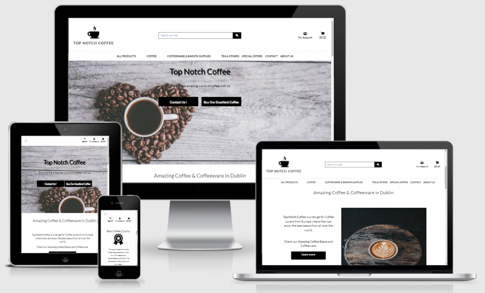

[GitHub Repository Link](https://github.com/SantiagoYanezFerreiro/Top_Notch_Coffee)

[Live Page Link](https://topnotchcoffee.herokuapp.com/)

Top Notch Coffee

Coffee connects people, calms the mind and brings harmony and balance.
Top Notch Coffee is an e-commerce site that sells the best coffee beans in town.
Explore the misterious and amazing world of coffee with us!

## User Experience

### General User Goals

• Users want to easily login anytime, so that they can get access to my saved profile details and make next purchase quicker

• Users want to reset my password if I forgot it, so that they can get access to my profile again.

• Users want to be able to change their password, so that they can create the stronger password (e.g.in case they published my old password somewhere) to protect my personal details.

• Users want to be able to change my email or add the second email, so that they can have an easier access to the website's functionality and to gain more flexibility.

• Users want to create my own account, so that they can save, view and edit my profile details and view my order history.

• Users expect to access the website from any device, so that they can use the website anytime and anywhere.

• Users expect to easily navigate the website, so that they can quickly find what I'm looking for.

• Users want to easily access social media links of the company, so that they can read more information about it.

• Users want to read a summary info about the business, its ideas and benefits, so that they can quickly decide if it is suitable for me.

• Users want to find an information about the company, to know what they do, what their main principles and ideas.

• Users want to view events that happen in the coffee club this week in Dublin, so that they can come and join any event.

• Users want to see the location of the Coffee Club.

• Users want to be able to easily contact the owner/manager of the company, so that they can write an additional query or ask a question.

• Users want to learn more about different types of coffee ceremonies, culture, and history in general.

• Users want to view service details and product details (e.g. image, price, description), so that they can book/buy some of them.

• Users want to search and filter the products easily, so that I can quickly find a specific product they are looking for.

• Users want to view and modify my order in the cart before completing it, so that they can make last changes easily before proceeding to payment.

• Users want to view a total price of my purchases and delivery cost, so that they will understand and see how much I will be charged.

• Users expect to make payments by card in a safe and secure way, so that they won't be concerned about the safety of my card details and won't be charged incorrectly.

• Users want to receive an email confirmation after checkout, so that they can make sure that payment was successful.

### Organisation Goals:
• Increase Brand Awareness and Brand Image.

• Increase company revenue while offering a secure, professional, and intuitive website.

• The company wants to be able to update/delete/create products.

### Colour Scheme

• The main colors used on the site are #white, #191919 and #fab162.

### Typography

The Lato font is the main font of the website with Arial and sans-seriff as fallback. I opted for Lato because it's a sans-seriff that looks stylish and is easy to read.

### Imagery

Used FontAwesome and mainly Unsplash.com for this purpose.

## Wireframes

I have included all Wireframes in another separate file: 

### Modifications from the Original Wireframes

## Features

•	**Header Logo** – Present on every page, clicking on it allow users to access the home page.

•	**Header Navigation Bar** – Allows visitors to easily navigate all the website's pages and access the desired section/information.

•	**Home Page** – Contains an introduction with general info about the company and its main products.

•	**Abous Us** – Divided into three sections: Who we Are, Our mission and principles and Our History.

•	**Products Page** – Page that lists all products the company sells. Each product is displayed in a card with info about their price, the option to add it to the cart and read a description of it and a picture.

•	**Product ddetails page** – Accesed after  clicking on a product. Contains the following info about the selected item: category, description, price, name and image. 

•	**Cart** – Summary of the user order containing all selected products with their respective info - mainly the price, name and the product picture .

• **Checkout** – Contains an order summary including general info. Checkout form to confirm Personal details, Payment and Billing/Shipping Info.

• **Checkout Success** – A Thank you message that is displayed after having succesfully confirmed the order. Also contains a summary of the info so that customers can confirm all info is correct.

• **Profile Page** – Contains Info of the user: Personal Details, Shipping Info and Billing Details. Also let them change the password and their details.

• **Passwort reset** – Users can request a password reset. They will be sent a link to their email with all the necessary info.

•	**Footer** – Social Media Links and logo to go back to the home page.

•	**Contact Page** - Allows visitors to contact the company through the contact form

## Features to Implement in the future

There are a couple of extra things that I think would make the website more appealing and the visitors' experience more complete:

• User Reviews: User should have the option to add a star-based review with related comments and images.

• A more complete profile page where users can add personal Info and have a profile picture.

• A coffee club with the possibility of getting a monthly suscription and receive special products delivered home.

• The possibility to rank customers based on their spending and use email marketing to send special offers to loyal customers.

## Information architechture
### Database Choice

During the development of the project I worked with sqlite3 database which is installed with Django.
For production, a PostgreSQL database is provided by Heroku as an add-on.

### Data Modelling

## Technologies Used

### Languages Used

• **HTML5**

• **CSS3**

• **Bootstrap**

• **JavaScript**

• **Django**, **Jinja**, 

• **Python**

### Frameworks, Libraries & Programs Used

• **GitPod**: Used as the Development IDE.

• **Bootstrap4**: layout to make the form responsive, used a CDN to include it in the project.

• **FontAwesome**: Great Icons Resource.

• **Google-Fonts**: Great Icons Resource.

• **Psycopg2**: -  Enables PostgreSQL to function with Django.

• **Stripe**: Allows visitor to pay online.

• **Auto-Prefixer**: Website based on Visual Studio Extension that adds all necessary extensions to the webite so that it works properly on all major browsers.

• **Django Crispy Forms**: Used to style Django Forms.

• **PIP**: To install all necessary packages and tools

• **Unsplash**: Website that offers high quality free images.

• **Realfavicongenerator**: Used to create the Favicon.

• **FreeLogoDesign**: Tool used to design the logo.

• **Balsamiq Wireframes**: Great Wireframing Software.

• **SQLite**: For the development database.

• **PostgreSQL**: Used in the production database.

## Testing

### Validators

#### HTML

The HTML code was tested through W3C Markup Validation Service. Revealed several issues regarding Jinja templating, since this format is not recognised by the validator. 

#### CSS

The CSS code was tested through W3C Markup Validation Service. Since it does not recognize all CSS variables (colours and fonts variables were used), there were several Parse Errors found that could be ignored.

#### JavaScript

The JS code was tested through JSHint Validation Service. 

#### Python

All the Python files were tested through PEP8 Online validator and further changes were made to make the code PEP8 compliant where possible.

An excel file with info about the tests performed was included in the repository. Testing File Attached

### High Level Test Classes

### Test Results

Complete Test Info can be found here ()

It is an .xlsx file and will a compatible program like excel or google docs to open the file.

### Compatibility and Responsiveness

Mentioned in the test cases excel file. The site was checked acrros multiple screen sizes (big screens, laptops, tablets, phones, small phones, etc) and browsers (Chrome, Edge and Firefox).

### Issues & Problems found during Testing

#### Further Testing

• The Site was tested on Google Chrome, Explorer, Opera and Microsoft Edge.

• The website was also checked on desktop, tablets and several phone devices (Iphone, Xiaomi, Xperia).

• All links were double checked to ensure they work as desired.

• Friends were also asked to check the website and give feedback about the site and any errors when found.

#### Known Bugs  & Problems 

•	I struggled dealing with so many keys that shouldnt be exposed publicly. There was an issue and my env.py file was exposed temporally on the public repo involuntariy. Managed to sorted it out after a while and hide it.
•   Also accidentally pushed my Database_URL on the repo. I initally didn't know that it was supposed to be hidden as well.

## Deployment

The website was developed to Heroku, while using Gitpod a a development environment and commiting all changes to GitHub., committed to git and pushed to GitHub. 

### GitHub Pages

The project was developed using GitPod, committed to git and pushed to GitHub. It was then deployed with Github pages from its GitHub repository following these steps:

•	Log in into GitHub.

•	Select the repository and open settings.

•	Scroll down to the GitHub Pages section and click Master Branch. With this, the website is deployed.

•	Go to the GitHub pages section to get the website link.

# Deployment

Gitpod:
    Create env.py file

    Add env.py file to gitignore

    Add details to env.py file:

      import os
      
    import os  
    os.environ["DEVELOPMENT"] = "True"    
    os.environ["SECRET_KEY"] = "<Your Secret key>"    
    os.environ["STRIPE_PUBLIC_KEY"] = "<Your Stripe Public key>"    
    os.environ["STRIPE_SECRET_KEY"] = "<Your Stripe Secret key>"    
    os.environ["STRIPE_WH_SECRET"] = "<Your Stripe WH_Secret key>"     

    In terminal create a requirements.txt file by typing pip3 freeze --local > requirements.txt

    In terminal create a Procfile by typing python app.py > Procfile

    In terminal add files, commit and push changes to Github

Deploy a project to Heroku:

    Create a Heroku account and Log in on it
    From dashboard click new > create new app and add the desired name.
    When connected, click on settings > Config Vars and add key and value pairs. Variables shoud be the same as in the env.py file
    From Deploy open Automatic deployment and Connect to GitHub section, then click on github username and repository name
    Heroku will receive all info from your Github repository. Wait for the succesfully completed message.
    Click Open App from top right corner to view the app in a new window.

## Cloning

• Type ‘cd’ in the terminal followed by the desired directory name where 
it will get cloned.

• Click on ‘Code’ (the green drop-down button on the top of the page).

• Copy the last link and type and type ‘git clone’ followed by the copied name.

## Content
• Social Media Icons are from Font Awesome.

• Bootstrap Navbar Documentation helped me to create the navigation menu.

### Forking

### Cloning

•	Type ‘cd’ in the terminal followed by the desired directory name where 
it will get cloned.

•	Click on ‘Code’ (the green drop-down button on the top of the page).

•	Copy the last link and type and type ‘git clone’ followed by the copied name.

## Credits

## Code

Used the Bootstrap library to make the site responsive. Also took advantages of its built-in classes, for example to make the nav menu responsive.

## Content

•	Social Media Icons are from Font Awesome.

•	Bootstrap Navbar Documentation helped me to create the navigation menu.

## Media
•	Pictures are from Unsplash.com, Pexels and Google Images.

•	The favicon was created using the resource [Realfavicongenerator](https://realfavicongenerator.net/)

## Acknowledgements
•	My mentor Narender Singh, was of great help in this project and introduced me to good changes and techniques to implement on it.

•	I checked projects from other students to get an idea of the scope of the project and as inspiration for my project.

## Disclaimer
This is a fictional company and was created as my MS4 Code Institute Project.

